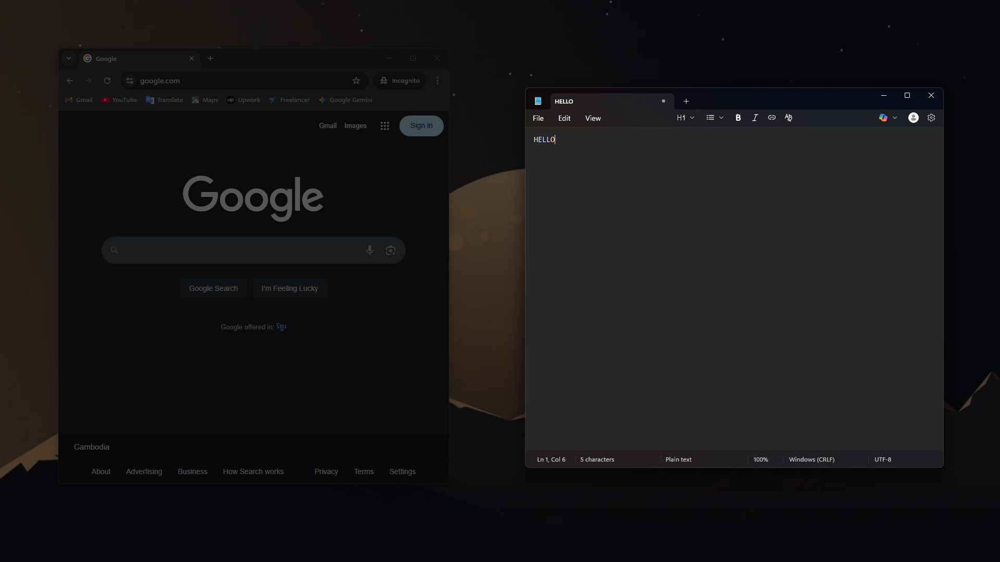

# Aura: Active Window Dimmer

Aura is a lightweight Windows desktop application that enhances your focus by dimming all inactive areas of your screen, highlighting only the currently active window. It's perfect for reducing distractions and improving concentration on the task at hand.

---

## ✨ Features

* **Dynamic Active Window Highlight:** Automatically dims the entire screen except for the window you're currently interacting with.

* **Customizable Dimming:** Adjust the opacity and color (Red, Green, Blue channels) of the dimming overlay to suit your preference.

* **System Tray Integration:** Runs silently in your system tray, providing easy access to controls and an exit option.

* **Lightweight and Efficient:** Designed to be minimal in its resource usage.

* **"My Desktop or File Explorer window isn't undimming!"**
    Aura is designed primarily to highlight application windows. By default, it might not undim system-level elements like the Windows Desktop, File Explorer windows, the Start Menu, or context menus that are part of the `explorer.exe` process. This is an intentional design choice to prevent potential flickering or conflicts with Windows' own Z-order management for these specific components.

---

## 🛠️ Technologies Used

* **C#**

* **WPF (.NET)**

* **Win32 API (P/Invoke)** for low-level window management.

---

## 📄 License

This project is licensed under the MIT License - see the `LICENSE` file for details.
